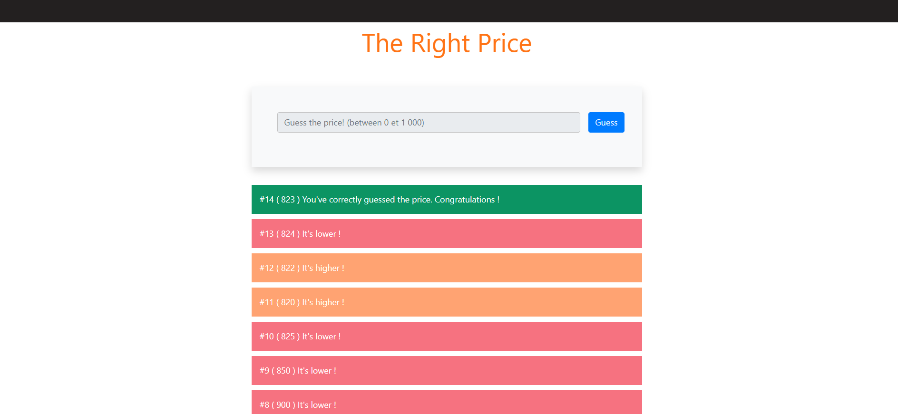

# 🎯 The Right Price

A simple JavaScript guessing game — guess a random number between 0 and 1000.

---

## 📖 Description

This project is an interactive game built with **JavaScript**, **HTML**, and **CSS** (using **Bootstrap**).  
The user must guess a random number generated between 0 and 1000.  
After each guess, the game gives feedback: whether the number is too low, too high, or correct.

It's a great mini-project to practice:

- DOM manipulation  
- Event handling  
- Basic JavaScript logic

---

## ✅ Features

- 🔢 Generates a random integer between 0 and 1000  
- 🧠 Validates user input to ensure it’s a number  
- 💬 Displays feedback messages after each guess  
- ⛔ Disables input after the correct guess  
- ❌ Shows an error message for invalid input  
- 📱 Responsive design

---

## 🚀 Technologies Used

- HTML5  
- CSS3 / Bootstrap  
- JavaScript (Vanilla)

---

## 📷 Screenshot for the application

---